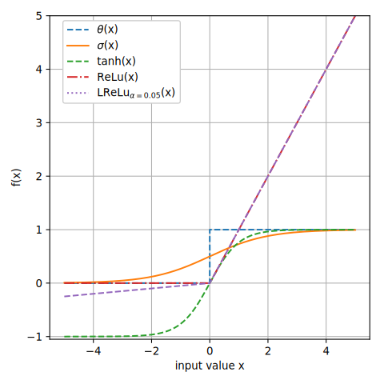
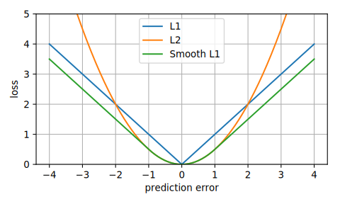

# Figures

These figures, used in my doctoral thesis, are all licensed under creative commons (CC BY 4.0) and are thus free to be used in other works (given proper referencing).

# Theoretical Background
## Machine Learning

Figure 2.1: Pattern recognition pipeline, showcasing the difference between traditional machine learning and deep learning.

Figure 2.2: Main machine learning tasks on the example of a microscopy image patch

## Deep Learning

Figure 3.1: A single neuron with inputs , weights , bias  and activation function ).

Figure 3.2: Activation functions and their derivatives commonly used within neural networks. Left panel shows activation functions and their output, right panel shows derivatives.

Figure 3.3: Visualization of a fully connected layer employing matrix operations. Note that this can also be thought of as successive application of intermedia functions <b><i>h</i></b> and <b><i>v</i></b>.

Figure 3.4: Gradient descent example]{Gradient descent applied on a non-convex function. Two initializations (red and blue line) have been chosen, leading to different results

Figure 3.5: Layered backpropagation]{Layered backpropagation. Adapted from Maier et al.: A gentle introduction to deep learning in medical image processing (Zeitschrift fuer medizinische Physik)

Figure 3.6: Loss functions commonly used in deep learning for classification and regression.

Figure 3.7: Segmentation loss functions and the definition of true positive, false positive and false negative.

Figure 3.8: 2D convolution on the example of a small image of a mitotic figure. The convolution operation is sliding a multiplicative kernel over the complete image.

Figure 3.9: Inception module (redrawn from: Szegedy et al.: Going deeper with convolutions (CVPR 2015))

Figure 3.10: Residual layer (redrawn from: He et al.: Deep Residual Learning for Image Recognition (CVPR 2016))

Figure 3.11: Comparing Yann LeCun's LeNet-5 architecture from 1989 to Krizhevsky's AlexNet architecture from 2012

Figure 3.12: Evolution of R-CNN approaches: R-CNN, Fast R-CNN and Faster R-CNN.

Figure 3.13: Anchor boxes of two sizes and three aspect ratios, visualized on a mitotic figure (blue bounding box). Red anchor is only match (IOU>0.5).

Figure 3.14: Comparison of encoder-decoder structures in auto-encoder, FCN, U-Net and Feature Pyramid Network.

Figure 3.15: Basic structure of Generative Adversarial Networks

Figure 3.16: Cycle consistency loss for target domain images ))) and adversarial loss for source domain )) are not shown due to symmetry.

Figure 3.17: Class Activation Maps (CAM) to visually display model attention, calculated for a ResNet-18 model pre-trained on ImageNet. Second to fourth column show bilinearly interpolated class activation maps of class ranked 1st to 3rd (as overlay to original image).

Figure 3.18: Cell inversion when using domain-transfer of microscopy images using CycleGAN.

# Confocal Laser Endomicroscopy
## Head and Neck Squamous Cell Carcinoma

Figure 4.1: Upper layers of the skin with squamous cell carcinoma (SCC), a tumor developing from the upper layers of the epithelium.

Occurrence of oral squamous cell carcinoma, based on an image published in Aubreville et al. (2017): Automatic Classification of Cancerous Tissue in Laserendomicroscopy Images of the Oral Cavity using Deep Learning (Scientific Reports) (CC BY) visualization using data from Ariyoshi2008 et al.: Epidemiological study of malignant tumors in the oral and maxillofacial region: Survey of member institutions of the Japanese Society of Oral and Maxillofacial Surgeons, 2002 (International Journal of Clinical Oncology, 2008)

<object data="theory/PatternRecognition.pdf" type="application/pdf" width="700px" height="700px"> </object>

